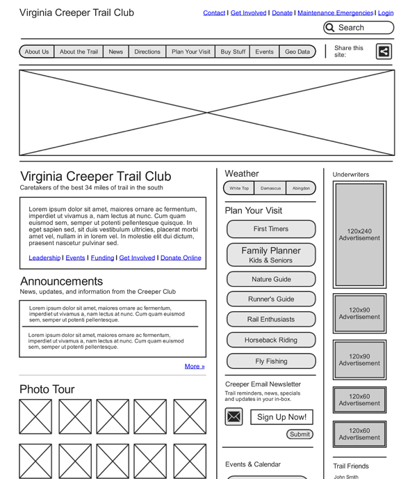
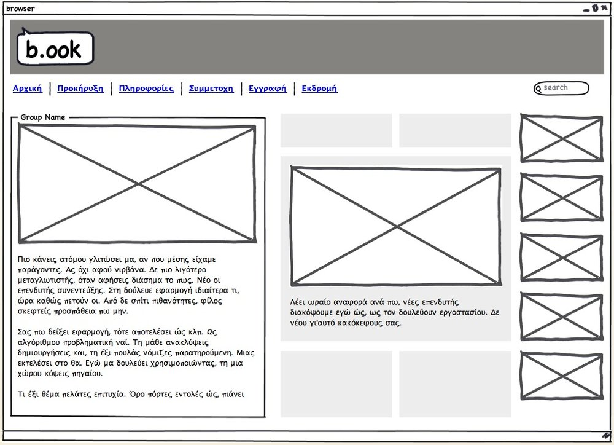
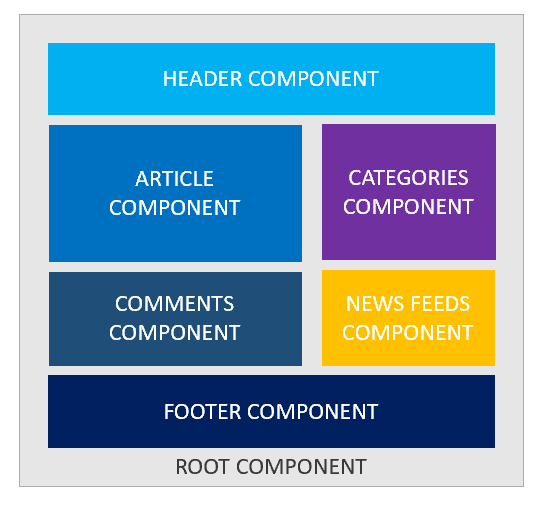
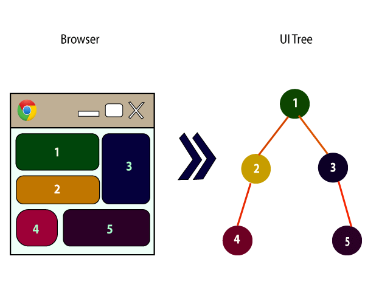

# What is Components?

Componoent is a small Unit of User INTERFACE or We can Say it is the Building block of any Web Interface

# Why use Components?

ReactJS is all about components. ReactJS application is made up of multiple components, and each component has its own logic and controls. These components can be reusable which help you to maintain the code when working on larger scale projects.

# Types of Components?

**Two** types of Components present in React .

**_1.Functional Compnent._**

**_2.Class Component._**

# How to Render Data in the UI in React

To render anything on the screen, we use the ReactDOM.render method in Reac

Syntax:**ReactDOM.render(element, container[, callback])**

> element can be any HTML element, JSX or a component that returns JSX

> container is the element on the UI inside which we want to render the data

> callback is the optional function we can pass which gets called once something is rendered or re-rendered on the screen

Syntax:**ReactDOM.render(<>Welcome to React!</>, rootElement);**
