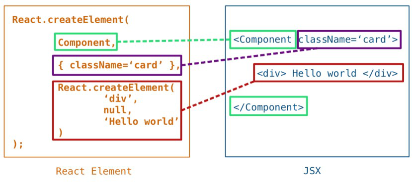

# What is JSX ?

JSX stands for JavaScript XML.

JSX allows us to write HTML in React.

JSX makes it easier to write and add HTML in React.

# Coding JSX

JSX allows us to write HTML elements in JavaScript and place them in the DOM without any createElement() and/or appendChild() methods.

JSX converts HTML tags into react elements.

