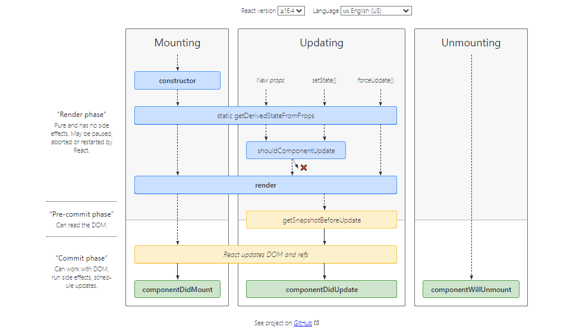
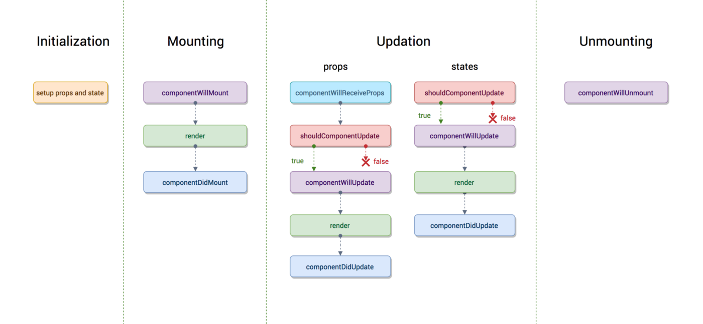

# React Component Life-Cycle

In ReactJS, every component creation process involves various lifecycle methods. These lifecycle methods are termed as component's lifecycle. These lifecycle methods are not very complicated and called at various points during a component's life. The lifecycle of the component is divided into four phases. They are:

- Initial Phase

- Mounting Phase

- Updating Phase

- Unmounting Phase

Each phase contains some lifecycle methods that are specific to the particular phase.

---

# 1. Initial Phase

It is the birth phase of the lifecycle of a ReactJS component. Here, the component starts its journey on a way to the DOM. In this phase, a component contains the default Props and initial State. These default properties are done in the constructor of a component. The initial phase only occurs once and consists of the following methods.

### - getDefaultProps()

It is used to specify the default value of this.props. It is invoked before the creation of the component or any props from the parent is passed into it.

### - getInitialState()

It is used to specify the default value of this.state. It is invoked before the creation of the component.

# 2. Mounting Phase

In this phase, the instance of a component is created and inserted into the DOM. It consists of the following methods.

### - componentWillMount()

This is invoked immediately before a component gets rendered into the DOM. In the case, when you call setState() inside this method, the component will not re-render.

### - componentDidMount()

This is invoked immediately after a component gets rendered and placed on the DOM. Now, you can do any DOM querying operations.

### - render()

This method is defined in each and every component. It is responsible for returning a single root HTML node element. If you don't want to render anything, you can return a null or false value.

# 3. Updating Phase

It is the next phase of the lifecycle of a react component. Here, we get new Props and change State. This phase also allows to handle user interaction and provide communication with the components hierarchy. The main aim of this phase is to ensure that the component is displaying the latest version of itself. Unlike the Birth or Death phase, this phase repeats again and again. This phase consists of the following methods.

### - componentWillRecieveProps()

It is invoked when a component receives new props. If you want to update the state in response to prop changes, you should compare this.props and nextProps to perform state transition by using this.setState() method.

### - shouldComponentUpdate()

It is invoked when a component decides any changes/updation to the DOM. It allows you to control the component's behavior of updating itself. If this method returns true, the component will update. Otherwise, the component will skip the updating.

### - componentWillUpdate()

It is invoked just before the component updating occurs. Here, you can't change the component state by invoking this.setState() method. It will not be called, if shouldComponentUpdate() returns false.

### - render()

It is invoked to examine this.props and this.state and return one of the following types: React elements, Arrays and fragments, Booleans or null, String and Number. If shouldComponentUpdate() returns false, the code inside render() will be invoked again to ensure that the component displays itself properly.

### - componentDidUpdate()

It is invoked immediately after the component updating occurs. In this method, you can put any code inside this which you want to execute once the updating occurs. This method is not invoked for the initial render. 4. Unmounting Phase
It is the final phase of the react component lifecycle. It is called when a component instance is destroyed and unmounted from the DOM. This phase contains only one method and is given below.

### - componentWillUnmount()

This method is invoked immediately before a component is destroyed and unmounted permanently. It performs any necessary cleanup related task such as invalidating timers, event listener, canceling network requests, or cleaning up DOM elements. If a component instance is unmounted, you cannot mount it again.

# 4. Unmounting Phase

It is the final phase of the react component lifecycle. It is called when a component instance is destroyed and unmounted from the DOM. This phase contains only one method and is given below.

### - componentWillUnmount()

This method is invoked immediately before a component is destroyed and unmounted permanently. It performs any necessary cleanup related task such as invalidating timers, event listener, canceling network requests, or cleaning up DOM elements. If a component instance is unmounted, you cannot mount it again.
